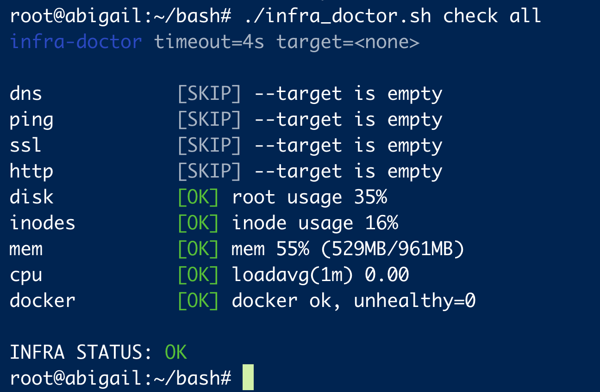

# infra-doctor

SRE-style infrastructure health check tool written in pure Bash.

infra-doctor — это лёгкий CLI-инструмент для быстрой диагностики инфраструктуры перед деплоем, во время инцидентов или для регулярных проверок серверов.

Работает как один Bash-скрипт без зависимостей от внешних фреймворков.

## Features

- Проверка DNS и сети
- Проверка SSL сертификатов
- HTTP/HTTPS health checks
- Мониторинг диска, памяти и CPU
- Проверка Docker
- Цветной вывод с итоговым статусом
- Подходит для ручного использования и CI/CD

## Installation

Сделайте скрипт исполняемым:

chmod +x infra-doctor

(Опционально) установить глобально:

sudo mv infra-doctor /usr/local/bin/

## Usage

Показать доступные проверки:

infra-doctor list

Проверить всё для домена:

infra-doctor check all --target example.com

Выборочные проверки:

infra-doctor check dns ssl http --target api.example.com

Локальные проверки сервера:

infra-doctor check disk mem cpu docker

## Exit Codes

0 — OK  
1 — WARN (degraded)  
2 — FAIL

Подходит для использования в CI/CD пайплайнах.

---

Minimal. Fast. Portable.

